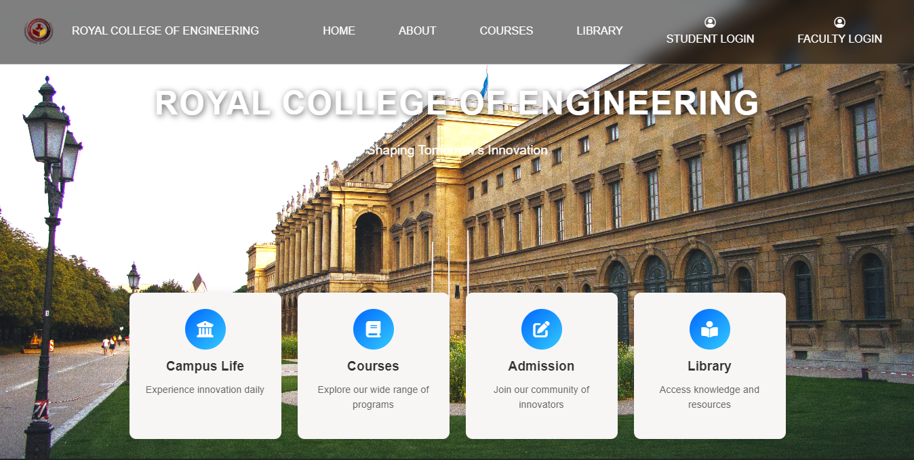
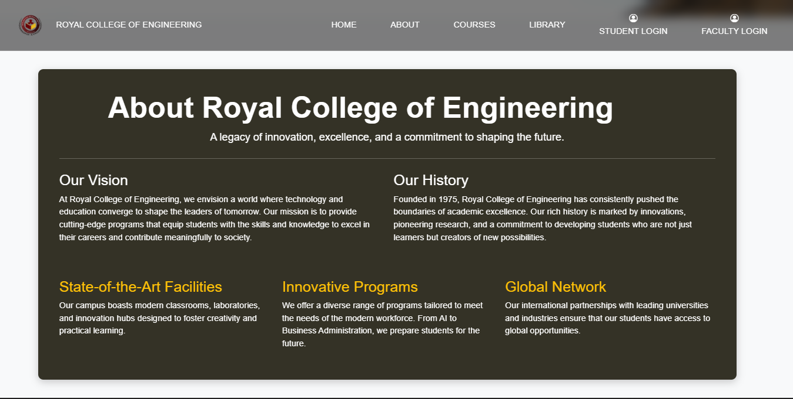
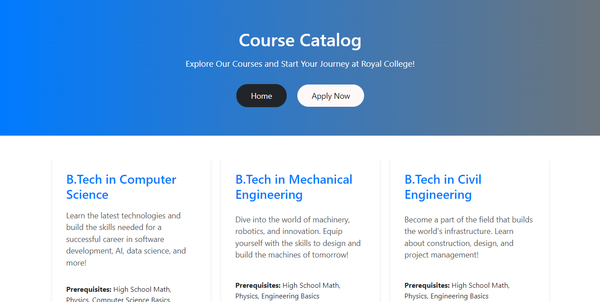
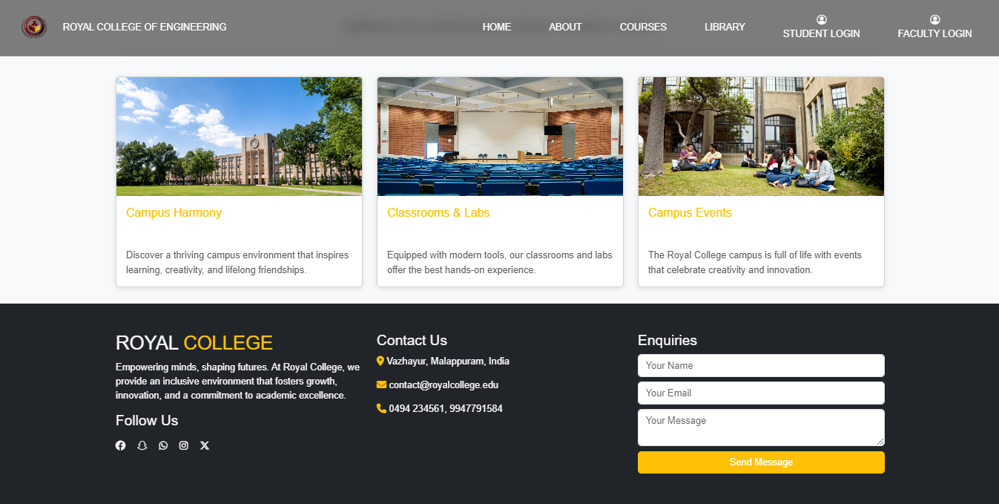
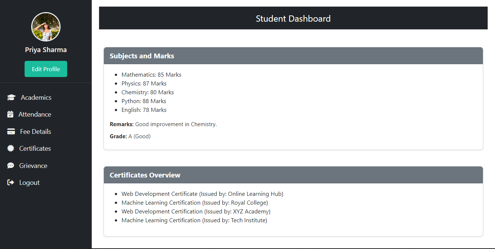
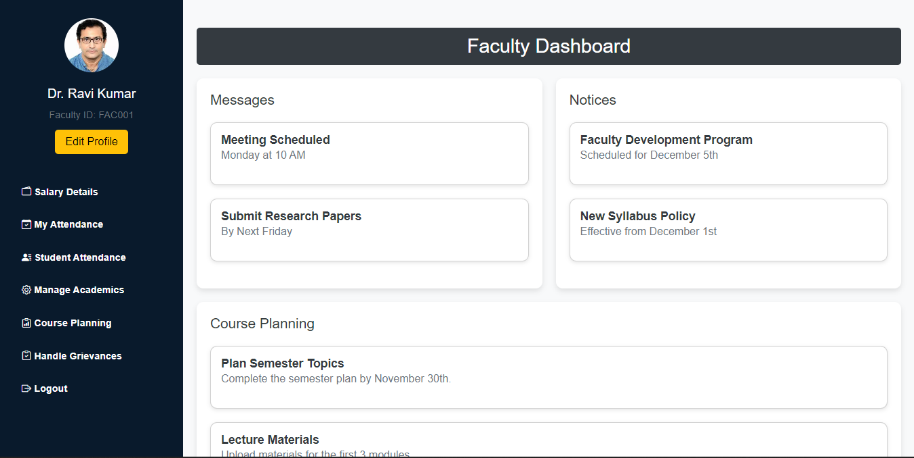
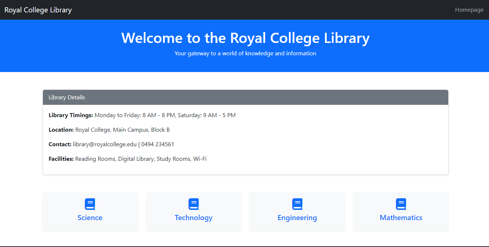
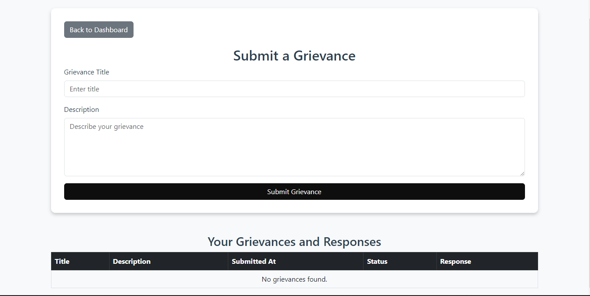
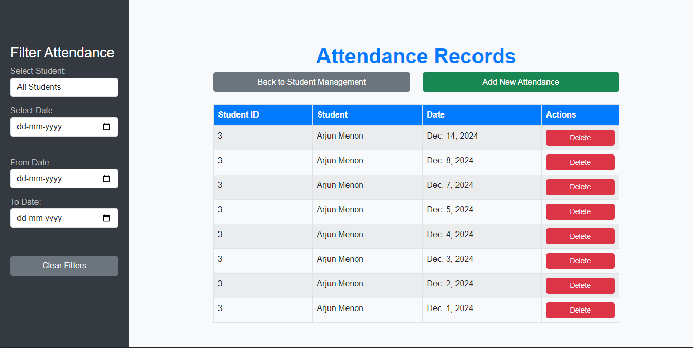
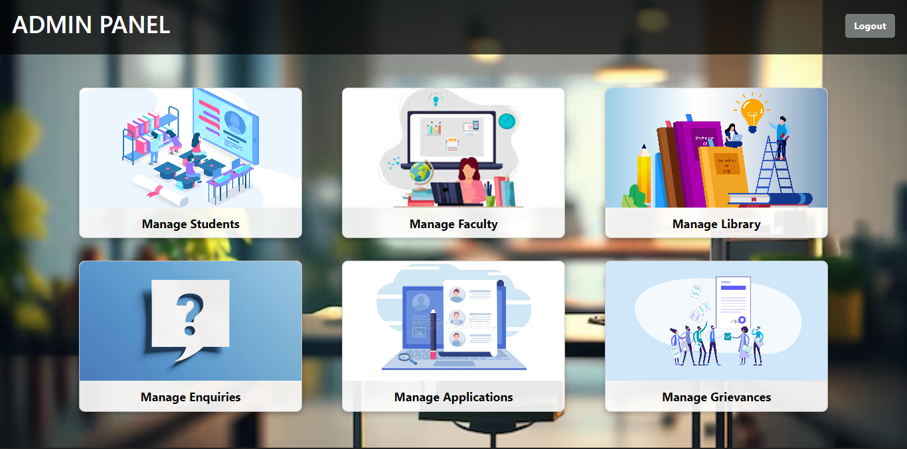

# College Management System

A Django-based web application designed for managing various college functionalities, including student admissions, faculty management, library management, course planning, and grievance handling. The system integrates AI-powered attendance monitoring and provides an interactive interface for both administrative staff and faculty.

- **Main View**:
- 
    
- **About Section**:
- 
    
- **Courses Offered**:
- 
    
- **Footer Section**:
- 
   

## Features

- **Student Management**: Add, edit, and manage student records, including academic details, attendance, certificates, and fees.
- **Faculty Management**: Manage faculty details, salary, attendance, and course planning.
- **Library Management**: Track and manage library books and their availability.
- **Course Planning**: Manage courses offered and assign faculty.
- **Grievance Management**: Handle student and faculty grievances.
- **Attendance Monitoring**: Automated controlling and monitoring.
- **Admin Dashboard**: An intuitive interface for managing the entire system with ease.

- **Student Dashboard**
-  
  

- **Faculty Dashboard**
- 
  

- **Library Management Overview**
- 
  

- **Library Books**
- 
  

- **Courses**
- 
  

- **Grievance Submit**
- 
  

- **Attendance Management**
- 
  

- **Admin Dashboard**
- 
  

## Installation

### Requirements

- Python 3.8+
- Django 4.0+
- PostgreSQL or MySQL for the database
- Other Python dependencies specified in `requirements.txt`

### Steps to Setup

1. Clone the repository:

    `git clone https://github.com/yourusername/college-management-system.git`
    `cd college-management-system`

2. Create a virtual environment:

    `python -m venv venv`

3. Activate the virtual environment:

    - On Windows:
      `venv\Scripts\activate`
    - On macOS/Linux:
      `source venv/bin/activate`

4. Install the required dependencies:

    `pip install -r requirements.txt`

5. Setup the database (PostgreSQL/MySQL):

    - Update `DATABASES` settings in `collegeweb/settings.py` with your database configuration.

6. Run migrations:

    `python manage.py migrate`

7. Create a superuser to access the admin panel:

    `python manage.py createsuperuser`

8. Run the development server:

    `python manage.py runserver`

    Access the application at `http://127.0.0.1:8000/`.
   
